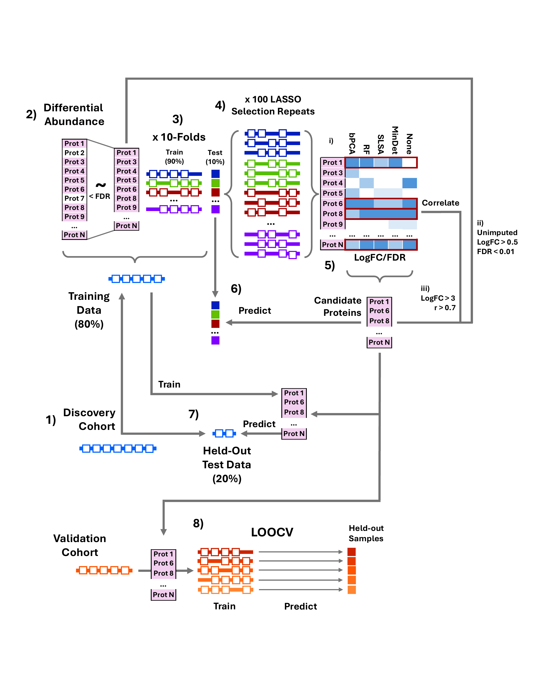

# Identification of Protein Biomarkers for the Discrimination of CNO

<!-- [DOI](XXX) -->


## Experimental Design



<p style="text-align: justify;">
<strong>Figure 1: In silico strategy for biomarker detection.</strong> 1) Discovery cohort was split into an 80% training and 20% held-out test set. 2) Differential abundance analysis was performed on the training set to perform univariate filtration of proteins. 3) Samples were segregated into 10 cross-validation (CV) folds. 4) Least absolute shrinkage and selection operator (LASSO) was performed 100 times with 90% sub-sampling on each of the training slice of the 10 CV folds independently. 5) Candidate proteins were selected as i) consistently detected across CV Folds and LASSO repeats, log fold-change (logFC) and false discovery rate (FDR) thresholds and 4 imputation methods (Bayesian PCA (bPCA), random forest (RF), structured least-squares algorithm (SLSA) or minimum deterministic (minDet)), or unimputed (None) ii) unimputed, with LogFC > 0.5 and FDR < 0.01, or iii) correlated with a Pearson’s r > 0.7 and LogFC > 3. 6) The 10 CV-folds were filtered for the candidate proteins and each training fold used to train a random forest to predict on its corresponding test slice. 7) A model was also trained on the full 80% training data using only the candidate proteins and this used to predict on the 20% held-out test data. 8) The validation cohort data were filtered to retain only candidate proteins detected and leave-one-out CV (LOOCV) was performed to validate protein biomarker panel performance, predicting on the held-out test samples. This pipeline was developed from the <a href="https://link.springer.com/article/10.1186/s12911-024-02578-0">ExPeDiTe pipeline</a> developed by Dr Eva Caamano Gutierrez and Dr Tanakamol Mahawan.
</p>

## Description

This repository contains all code that performs the analysis detailed in publication (TBC). In this, we perform robust, multi-step selection of protein biomarker candidates from serum proteomic profiles of paediatric patients that discriminate chronic non-bacterial osteomyelitis (CNO) from mimicking inflammatory conditions. Code runs analysis from the output data of [Spectronaut](https://biognosys.com/software/spectronaut/) up to figure generation for the publication. Please see the Supplementary Methods of the manuscript and Spectronaut parameter files provided in `params/` for details on the Spectronaut analysis.


## Setup & Install

To get the contents of this repository, perform the below.
 
```
git clone https://github.com/CBFLivUni/CNOSerumProtBiomarkers.git
```

`R` is required to run the analysis ([`R 4.4.3`](https://cran.r-project.org/bin/windows/base/old/4.4.3) was used for the results in the publication).

Each quarto `.qmd` document (see below) should run a common install script `installRLibs.R` in `install/` (see below).


## Data availability

Data will be made available upon publication and lifting of the embargo.

<!-- Data for the analysis is available from (LINK)(XXX). -->


## Directory structure

* `params` : Parameters that configure the analysis scripts. Also contained are experimental setup overview files that provide the configuration files for which Spectronaut was performed with for both discovery and validation cohort datasets.
* `install`: Contains a list of R packages `RLibs.txt` required to install to run the pipeline, as well as Rscripts to install them (`installRLibs.R`) and source custom code * `source_rscripts.R` from `utilities`. `packages_sessionInfo.txt` contains a tab-delimited table of all installed packages and their versions (excluding the base R packages).
* `utilities`: Contains helper functions and R scripts to perform the analysis.
* `logs`: Contains files that report the R session (output of `sessionInfo()`) including R and package versions, as well as the parameters that configure the whole analysis.
* `supporting_images`: Contains the image for Figure 1 in this README.


## Order of Execution

Quarto documents (`.qmd`) should be excecuted in the order indicated by numbers at the start of their names. These are as follows:

1. `01_cleanMetadata.qmd`: Takest in metadata and abundance data from Spectronaut and tidies it and formats it into a state for use during the project.
2. `02_dataProcessQC.qmd`: Quality checks and filtration on the data. This includes removing depleted proteins, filtering proteins and samples based on enumaration of missing values, investigating of quality control samples and evaluation of sample distributions.
3. `03_dataNormalisation.qmd`: Performs tests (including [NormalyzerDE](https://www.bioconductor.org/packages/release/bioc/html/NormalyzerDE.html)) to evaluate normalisation methods and applies the most optimal.
4. `04_eda.qmd`: Exploratory data analysis (EDA) on the dataset, primarily principal components analysis (PCA).
5. `05_dataImputation.qmd`: Performs imputation of the data with a range of methods.
6. `06_differentialAbundance.qmd`: Generates the 80%/20% Train/Test split on the data and performs differential abundance analysis on the Train slice. 
    * Associated with this is `06_differentialAbundance.R`, which is compiled it and used by `08_biomarkerSelectionCombinations.qmd` to generate different filtrations of the differential abundance analysis for multivariate selection.
7. `07_biomarkerSelection.qmd`: Performs multivariate selection using a modified [ExPeDiTe pipeline](https://github.com/EvaCaamano/ExPeDiTe_publication) for one set of input parameters and datasets. This document is not necessary to run by itself largely exists to be compiled into `07_biomarkerSelection.R`, which is executed by `08_biomarkerSelectionCombinations.qmd` below.
8. `08_biomarkerSelectionCombinations.qmd`: Loops over a range of input configurations for multivariate selection, defined in `biomarkerParams_gridSearch.R` and performs `07_biomarkerSelection.R` on the input.
9. `09_modelEvaluation.qmd`: Collates the outputs of the different runs performed by `08_biomarkerSelectionCombinations.qmd` and filters proteins given heuristics to obtain a final list of candidates.
10. `10_finalModel.qmd`: Evaluates the performance of the final candidates on the discovery cohorts. Model tuning is performed here as well.
11. `11_validationDataProcessQC.qmd`: Performs similar quality checks and filtration for `02_dataProcessQC.qmd` but for the validation cohort.
12. `12_validationDataNormEDA.qmd`: Performs EDA on the validation data, primarily PCAs and evaluating sample abundance distributions. Also normalises the data using the method chosen in `03_dataNormalisation.qmd`.
13. `13_validationDataImputation.qmd`: Performs imputation on the validation data.
14. `14_validationDataDiffAbundance.qmd`: Performs differential abundance analysis on the validation data as well as comparative analysis to the differential abundance analysis performed on the discovery data in `06_differentialAbundance.qmd`.
15. `15_validationDataPredictionModelling.qmd`: Evaluates the performance of the selected candidates on the validation data.
16. `16_biologicalContextualisation.qmd`: Functional annnotation of candidate proteins.
17. `17_figurePreparation.qmd`: Generation of figures for the publication.


## Affiliations

This project was performed by a collaboration between the University of Liverpool's [Computational Biology Facility (CBF)](https://www.liverpool.ac.uk/computational-biology-facility/) and [Center for Proteome Research (CPR)](https://www.liverpool.ac.uk/centre-for-proteome-research/), with [Alder Hey Children's Hospital Trust](https://www.alderhey.nhs.uk/), Liverpool. Lead researchers were [Dr Euan McDonnell](https://github.com/EuancRNA) and [Dr Eva Caamaño Gutiérrez](https://github.com/EvaCaamano) from the CBF, Dr Eve Roberts and Prof Christian Hedrich from Alder Hey Children's Hospital Trust and Dr Rosie Maher from the CPR. 

<!-- Additional collaborators from Christian's side -->
 
<!-- Additional affiliations - CPR, collaborators in Dresden, Vanderbilt, Liverpool etc -->


## Contact

Primary contacts for any information or questions relating to the code or analysis are [Dr Euan McDonnell](https://github.com/EuancRNA) (euan2mcd@liverpool.ac.uk) or [Dr Eva Caamaño Gutiérrez](https://github.com/EvaCaamano) @EvaCaamano (caamano@liverpool.ac.uk).
